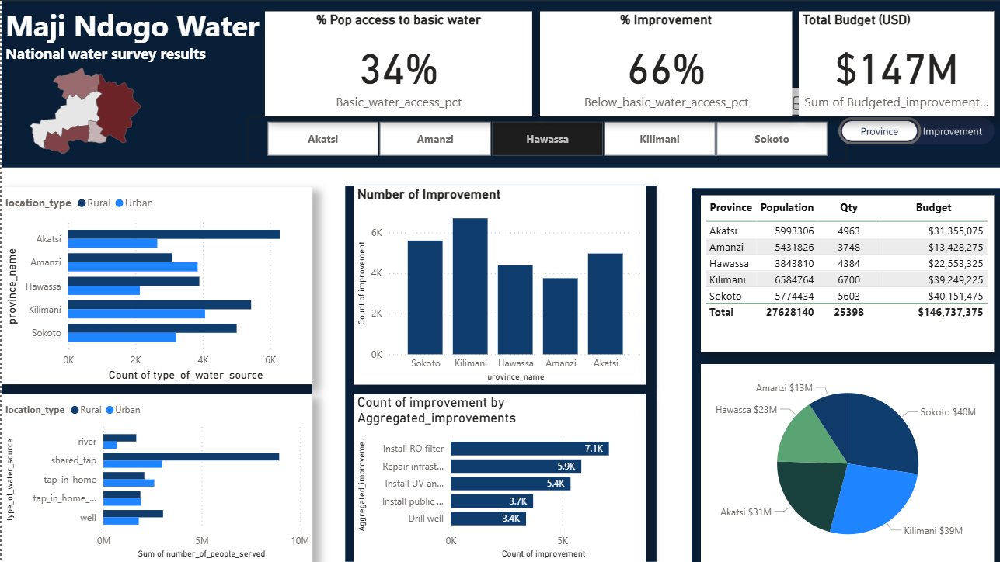

# PowerBiDataVisualizations
**Maji Ndogo Project Power BI Visualization README**
**Overview**

This Power BI visualization provides a comprehensive analysis of the Maji Ndogo water source improvement project. It presents data related to water access, quality metrics, and community engagement, helping stakeholders understand the impact of the project.



**Features**

Interactive Dashboard: Explore various visual elements that showcase key performance indicators related to water access and quality.
Dynamic Filters: Use filters to view data by regions, project phases, or specific metrics to gain tailored insights.
Visual Analytics: Includes charts, graphs, and maps to effectively convey information on water usage and community participation.

**How to Use**

Open the Power BI Desktop application.
Load the provided Power BI (.pbix) file for the Maji Ndogo project.
Utilize the filters on the dashboard to customize your view of the data.
Interact with the visuals to drill down into specific details regarding water access and quality.
Installation
Ensure you have Power BI Desktop installed.
Download the .pbix file from "https://github.com/K12Boateng/PowerBiDataVisualizations.git"

**Future Enhancements**

Additional metrics on long-term water quality trends.
Enhanced visualizations for better user experience and understanding.


# Customer Analysis Dashboard  

This project presents an interactive **Power BI dashboard** designed to analyze customer demographics, purchasing behavior, and income distribution. It provides actionable insights into customer segments to support business decisions in marketing, sales, and product strategy.  

---

**Customer Analysis**  

The **Customer Analysis Dashboard** highlights:  
- **Demographics**: Breakdown of customers by gender and average age.  
- **Engagement**: Customer review analysis and interactive filters by product categories.  
- **Purchasing Behavior**: Quantity purchased across product interests (Fashion, Home, Tech).  
- **Customer Base**: Total number of customers tracked.  
- **Income Insights**: Distribution of income by gender.  

---
  

## Key Metrics  

- **Average Age**: `40.88` years  
- **Number of Customers**: `100` total  
- **Gender Split**:  
  - Females: `57`  
  - Males: `43`  
- **Purchasing Insights**:  
  - Fashion: 12 Female, 5 Male  
  - Home: 7 Female, 5 Male  
  - Tech: 6 Female, 5 Male  
- **Income by Gender**:  
  - Female: `2.22M (43.47%)`  
  - Male: `2.88M (56.53%)`  

---

## Features  

- Interactive filters by product interest categories (**General, Fashion, Home, Tech**).  
- Gender-based demographic analysis.  
- Visualization of **income contribution by gender**.  
- Customer sentiment dimension through **review text filter**.  

---

## How to Use  

1. Clone the repository:  
   ```bash
   git clone https://github.com/username/customer-analysis-dashboard.git
   ```  
2. Open the `.pbix` file in **Power BI Desktop**.  
3. Explore the interactive dashboard, apply filters, and drill down into insights.  
4. Preview screenshots are available in the `/images` folder.  

---

## Business Value  

- Identifies **key customer segments** for targeted marketing campaigns.  
- Highlights **gender-based purchasing power** to inform promotions.  
- Reveals opportunities in **specific product categories**.  
- Provides a clear snapshot of the **customer base demographics**.  

---

## Tools & Technologies  

- **Power BI Desktop** (for dashboard design & DAX modeling)  
- **Power Query** (for ETL and data shaping)  
- **Sample/Anonymized Data** (for demo purposes)  


